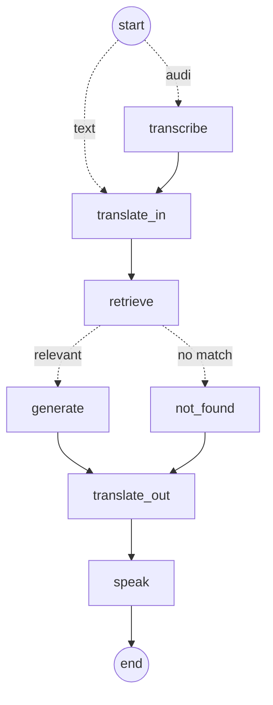

# Sahakar Saathi (AWS)

**A voice-first, multilingual assistant for farmers and cooperative (PACS) members, built on AWS.**

Built for the WeMakeDevs × AWS **First Commit: Bharat Builds** hackathon (Sept 17–20, 2026) — *Ship It* track.

## The problem

Farmers and PACS members lose out on crop insurance (PMFBY) and government schemes they already qualify for.
The rules are written in English or Hindi, in legal language, and spread across many portals. Farmers who speak
Tamil or another regional language, or who can't read well, end up depending on middlemen or missing
claim deadlines.

See [PROBLEM_STATEMENT.md](PROBLEM_STATEMENT.md) for the full problem statement.

## What it does

The assistant is a **LangGraph** state machine. Each step is a node, running on AWS Lambda:

1. **transcribe**: the farmer speaks in Hindi, Tamil or English, and **Amazon Transcribe** converts it to text. Typed questions skip this node.
2. **translate_in**: **Amazon Translate** translates the question to English.
3. **retrieve**: **Amazon Bedrock Knowledge Bases** searches the official scheme documents. The vectors are stored in **Amazon S3 Vectors**.
4. **Relevance check**: if nothing relevant is found, the graph goes to **not_found** and says so honestly, without calling the LLM. Otherwise it goes to **generate**.
5. **generate**: **Amazon Bedrock** (Claude) answers **only from those passages** and cites its sources.
6. **translate_out**: **Amazon Translate** translates the answer back to the farmer's language.
7. **speak**: **Amazon Polly** reads the answer aloud.



**Framework:** [LangGraph](https://github.com/langchain-ai/langgraph) for orchestration. Everything else runs on AWS: speech-to-text, text-to-speech, translation, embeddings, the vector database, RAG retrieval, the LLM, compute and storage.

## AWS services used

| Service | Role |
|---|---|
| Amazon Transcribe | Speech → text (hi-IN, ta-IN, en-IN) |
| Amazon Translate | Question/answer translation |
| Amazon Bedrock Knowledge Bases | Managed RAG: ingestion + semantic retrieval with source metadata |
| Amazon Bedrock – Titan Text Embeddings v2 | Embeddings for the knowledge base (1024-dim) |
| Amazon S3 Vectors | Vector database for the knowledge base |
| Amazon Bedrock – Claude | Grounded answer generation |
| Amazon Polly | Text → speech (Hindi, Indian English) |
| AWS Lambda + Function URL | Runs the LangGraph agent + serves the web app |
| Amazon S3 | Source documents for the knowledge base + temporary audio (auto-deleted after 1 day) |
| AWS SAM / CloudFormation | Infrastructure as code |

## Project structure

```
app/            Lambda function (API + web UI)
  handler.py    HTTP routing (web page + /api/ask)
  graph.py      LangGraph state machine: the voice → answer flow
  services.py   AWS calls (Transcribe, Translate, Bedrock, Polly)
  rag.py        Retrieves passages from the Bedrock Knowledge Base
  static/       Frontend (single HTML page)
corpus/         Source documents the assistant is allowed to answer from
scripts/
  sync_corpus.py  Uploads corpus sections to S3 and runs KB ingestion
template.yaml   AWS SAM template (app + knowledge base + S3 Vectors)
```

## Deploy

Requires an AWS account (region `us-east-1`) with Bedrock model access enabled for Claude Haiku 4.5 and Titan Text Embeddings v2.

```bash
brew install awscli aws-sam-cli
aws configure            # or: aws configure sso
sam build
sam deploy --guided --stack-name sahakar-saathi --capabilities CAPABILITY_IAM   # first time; afterwards `sam deploy`
python scripts/sync_corpus.py   # load corpus/ into the knowledge base (rerun whenever corpus changes)
```

The stack prints the live URL (`AppUrl`) when the deploy finishes. To add a scheme, add a Markdown file to `corpus/` in the same
`# Title` / `Source:` / `## Section` format and run the sync script again.

## Limitations

- Amazon Polly has no Tamil voice, so Tamil answers come back as text only. Hindi and English answers are also read aloud.
- The corpus is a small starter set (PMFBY). The answers are only as good as the documents in `corpus/`.
- This is a hackathon prototype. It is not legal or financial advice.
